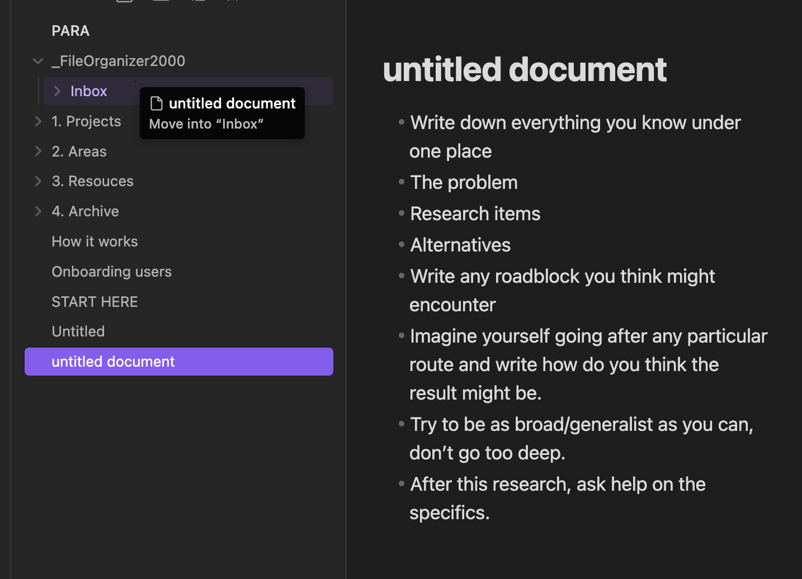
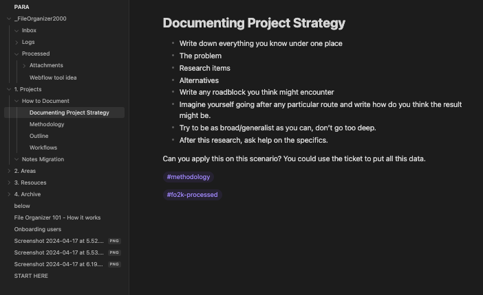

# File Organizer 101 - How it Works

1. Select any of your files or folders within your vault.

2. Move your item(s) into the dedicated `FileOrganizer2000/Inbox` as seen in the screenshot below.

    **Pre-processed file:**

    

3. Give it some time to process. Usually, it takes less than a second for a text file. Audio or Image files may take longer.

4. Fo2k will then perform three key actions with the help of AI:

    I. Rename the document title †  
    II. Add tags if there are any connections with your other tagged files †  
    III. Move your file to the most appropriate folder. If no appropriate folder has been identified, the file moves to the `FileOrganizer2000/Processed` folder.  

    † *if enabled in plugins options*

    **Processed file:**

      

**Good to Know:**

- For audio files: a text transcription will be added to the processed document.
- For image files: annotations will be added to the processed document.
- More actions not covered in this doc are also configurable within the plugin options. We ship very regularly!
- Any file processed by fo2k will be tagged with #fo2k-processed.
